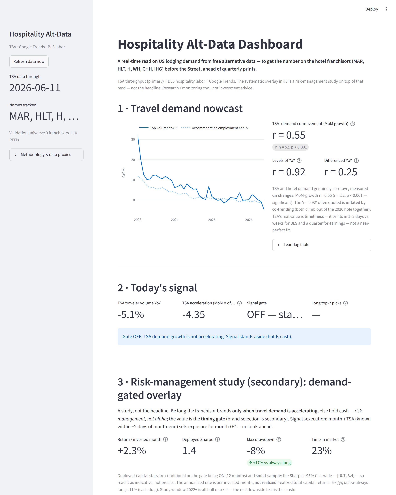

# Hospitality Alt-Data Dashboard

> **A real-time read on US lodging demand from free alternative data — to get the number on
> the hotel franchisors (MAR, HLT, H) before the Street, ahead of quarterly prints.**



A pipeline that turns free public alternative data — **TSA checkpoint throughput**, **BLS
hospitality labor**, and **Google Trends brand search** — into a near-real-time read on US
lodging demand, so you can form a view on the major hotel franchisors (MAR, HLT, H, +
WH/CHH/IHG) during the ~90-day blackout between earnings. Served through a Streamlit
dashboard with pre-earnings anomaly alerts. The systematic *demand-gated overlay* further
down is a risk-management study **on top of** that read — not the headline.

### How an analyst uses it
- **Between prints:** TSA + brand search give a demand read weeks ahead of BLS and a quarter
  ahead of company numbers — update your estimate while the Street is still flying blind.
- **Into a print:** gate ON (travel accelerating) → franchisors have historically firmed the
  next month; gate OFF → step back. A conviction/sizing input, not an autopilot.
- **Pre-earnings:** the anomaly panel flags unusual brand-search or travel moves before a
  name reports.

## Headline findings (computed on 2022-2026 data; as of 2026-06 snapshot)

| Result | Value |
|---|---|
| **Nowcast** — does TSA track the hotel-demand proxy? (measured on *changes*, not co-trending levels) | MoM-growth **r ≈ 0.55**; differenced-YoY r ≈ 0.25. *(Levels-of-YoY r = 0.92 is inflated by the shared post-COVID recovery trend — reported, not led with.)* |
| **Risk overlay**, return on **deployed** capital (study window 2022+) | when invested (~30% of months): **~45% annualized, deployed Sharpe ~2.0**, mean ≈ +3.3%/invested-month |
| **COVID stress test** (full 2019+ history) — the downturn evidence | **max drawdown −11% vs −44%** for always-long; the gate went to cash as travel collapsed |
| Does the gate help? (the test that matters) | gate-ON vs gate-OFF **p ≈ 0.09 — does not clear 5%**. (Per-position p ≈ 0.03 overstates it: positions within a month are correlated.) |
| Out-of-sample, pooled 20-name universe | hit rate = P(next-month up \| gate ON): franchisors ~68% vs ~58% base; REITs ~63% vs ~52%. Pooled linear r ≈ 0.12 (near-noise) — directional, not linear. |

> Numbers are a nowcast and move with each data refresh; the figures above are the
> reproducible output of `uv run python -m src.pipeline` on the date noted.

**The honest takeaway:** TSA is a clean, *timely* (1–2 day lag) read on lodging demand — but
the headline value is **timeliness, not fit**: on changes the co-movement is a moderate
~0.55, and the often-quoted 0.92 is inflated by two series co-trending out of COVID. The
trading angle is framed as a **risk overlay, not alpha**: judged on deployed capital it is
strong (~45% annualized / Sharpe ~2.0 *when invested*), and the **COVID stress test** is the
real proof — through the crash it held drawdown to **−11% vs −44%** by sitting in cash.
**Caveats kept loud:** the gate-help test is *not* significant (p ≈ 0.09); COVID is a single
event; several signal/universe configs were explored (multiple testing), so borderline
p-values deserve skepticism; and on *total* return the overlay trails buy-and-hold from cash
drag. The dashboard reports all of this rather than cherry-picking the flattering numbers.

## Data sources

| Signal | Source | Notes |
|---|---|---|
| TSA passenger throughput (daily) | TSA.gov passenger-volumes pages | Per-year archive URLs (public from 2019) stitched into a daily series; headline study window 2022+, full 2019+ used for the COVID stress test. |
| Brand search interest (weekly) | Google Trends via `pytrends` | Marriott / Hilton / Hyatt / Wyndham / Choice / IHG, US, relative interest. |
| Job openings, Leisure & Hospitality (monthly) | BLS public API (JOLTS) | The **"Indeed job postings" analog** — Indeed killed its public API and blocks scraping, so this is the keyless, reproducible hiring-demand proxy. |
| PPI, Traveler Accommodation (monthly) | BLS public API | **RevPAR-rate / ADR proxy.** |
| Accommodation employment (monthly) | BLS public API (CES) | Hospitality **demand** proxy used for the nowcast. |
| Equity prices + earnings dates | Yahoo Finance via `yfinance` | MAR/HLT/H + a 20-name validation universe (9 asset-light franchisors + 10 hotel REITs, tested separately). |

### Honest caveats
- **True RevPAR is STR data (paid).** This project uses BLS Accommodation employment as
  a hospitality-demand proxy and PPI Traveler Accommodation as a room-rate proxy. It is a
  RevPAR-*proxy* nowcast, not RevPAR.
- **Correlation is reported on changes.** The 0.92 levels-of-YoY figure is inflated because
  TSA and employment both co-trend out of the 2020 hole. The honest co-movement is on
  changes: MoM-growth r ≈ 0.55, differenced-YoY r ≈ 0.25.
- **Signal → execution rule (no look-ahead).** The gate uses month-*t* TSA (published within
  ~1–2 days of month-end) to set exposure for month *t+1*; backtest returns are strictly
  next-month. Employment/PPI are descriptive only and never enter the trade rule.
- **Deployed-capital framing.** Risk-adjusted stats are reported *conditional on being
  invested* (~30% of months); raw Sharpe vs always-long flatters the overlay because sitting
  in cash suppresses volatility. On *total* return the overlay trails buy-and-hold (cash drag).
- **Small sample / correlated cross-section / multiple testing.** ~16 signal-on months; the 2
  names held in a month move together, so effective N ≈ months, not positions. The gate-help
  test is *not* significant (p ≈ 0.09). Several signal/universe configurations were explored,
  so borderline p-values should be read with multiple-testing skepticism.
- This is a **research / monitoring tool, not investment advice.**

## Layout

```
config.py            tickers, universe, BLS series IDs, paths
src/data/            tsa.py  trends.py  bls.py  prices.py  cache.py  net.py (retry policy)
src/analysis.py      nowcast, signals, backtest, significance, risk, stress, earnings study
src/pipeline.py      orchestrates fetch -> analyze -> outputs/
src/notify.py        weekly regime-change email watcher
app.py               Streamlit dashboard
tests/               pytest unit tests (analysis math + notifier logic)
.github/workflows/   ci.yml (lint/type/test) + daily.yml (refresh) + weekly_notify.yml (email)
outputs/             summary.json + CSVs (regenerated each run, gitignored)
data/                cached raw data + notifier state (gitignored)
```

## Run it

This project uses [uv](https://docs.astral.sh/uv/) for dependency management.

```bash
# Install dependencies (creates .venv from uv.lock):
uv sync

# Recompute everything from source and print the numbers:
uv run python -m src.pipeline --force

# Launch the dashboard:
uv run streamlit run app.py
```

The pipeline caches raw data under `data/` (12-24h TTL); the dashboard's
**Refresh data now** button forces a re-fetch. No API keys are required — TSA, BLS, and
Google Trends are all keyless (set `BLS_API_KEY` only if you want a higher BLS rate limit).

## Development

```bash
uv run ruff check .      # lint
uv run ruff format .     # format
uv run mypy src app.py config.py   # type-check
uv run pytest -q         # tests
```

CI runs all four on every push/PR (`.github/workflows/ci.yml`); a scheduled job
(`daily.yml`) refreshes the data each morning and publishes the outputs as an artifact.

## Weekly regime-change email

`src/notify.py` closes the loop: it runs the pipeline, compares the current regime
(signal gate ON/OFF + active anomaly alerts) against the last-seen state, and emails a
summary **only when something changes**.

```bash
cp .env.example .env          # then fill in SMTP_* (Gmail needs an App Password)
uv run python -m src.notify --dry-run   # preview the email, no send
uv run python -m src.notify --always    # send now (first-time test)
uv run python -m src.notify             # send only if the regime changed
```

Schedule it weekly either way:
- **GitHub Actions** — `weekly_notify.yml` runs Mondays; add `SMTP_HOST/PORT/USER/PASSWORD`
  and `NOTIFY_TO` as repo secrets. State persists across runs via the actions cache.
- **Windows Task Scheduler** — weekly trigger running
  `uv run python -m src.notify` in this folder (with the `.env` values exported).
