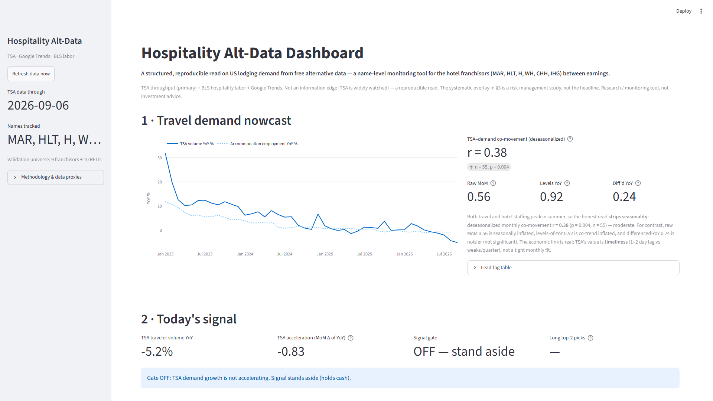
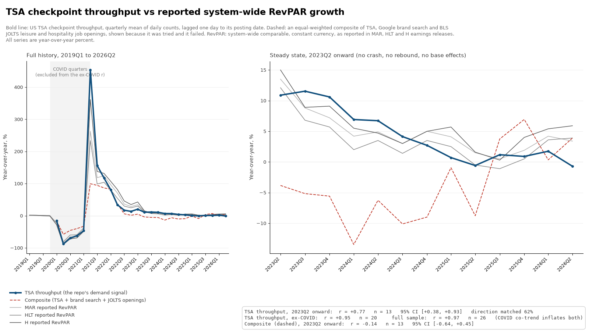

# Hospitality Alt-Data Dashboard

> **A structured, reproducible read on US lodging demand from free alternative data — a
> name-level monitoring tool for the hotel franchisors (MAR, HLT, H) between earnings.**



*Dashboard screenshot from a September 2026 run (TSA through 2026-09-06). The headline table below remains the frozen June 2026 snapshot; the reported-RevPAR comparison further down also uses data through September 2026.*

A pipeline that turns free public alternative data — **TSA checkpoint throughput**, **BLS
hospitality labor**, and **Google Trends brand search** — into a near-real-time read on US
lodging demand, to help form a view on the major hotel franchisors (MAR, HLT, H, +
WH/CHH/IHG) during the ~90-day blackout between earnings. Served through a Streamlit
dashboard with pre-earnings anomaly alerts. *Not an information edge* — TSA is widely watched
on the buy side — but a **reproducible, name-level read**. The systematic *demand-gated
overlay* further down is a risk-management study **on top of** that read, not the headline.

### How an analyst uses it
- **Between prints:** TSA + brand search give a structured demand read with a 1–2 day lag,
  ahead of the monthly BLS print and the quarterly company numbers — an input to your estimate.
- **Into a print:** gate ON (travel accelerating) → franchisors have historically firmed the
  next month; gate OFF → step back. A conviction/sizing input, not an autopilot.
- **Pre-earnings:** the anomaly panel flags unusual brand-search or travel moves before a
  name reports.

## Headline findings (computed on 2022-2026 data; as of 2026-06 snapshot)

| Result | Value |
|---|---|
| **Nowcast** — how closely does TSA track the hotel-demand proxy, *net of seasonality*? | **Deseasonalized MoM r ≈ 0.41 (p ≈ 0.003, n ≈ 52)** — moderate. Context: raw MoM 0.55 (seasonally inflated, both peak in summer); levels-of-YoY 0.92 (co-trend inflated); differenced-YoY 0.25 (noisy, not significant). |
| Does the gate help? (the test that matters) | gate-ON vs gate-OFF **p ≈ 0.09 — fails at 5%**, likely worse out-of-sample. (Per-position p ≈ 0.03 overstates it: positions within a month are correlated.) |
| **COVID stress test** (full 2019+ history) | parameter-free gate held max drawdown to **−11% vs −44%** for always-long, with no look-ahead — but this is *near-mechanical* (cash when acceleration craters) and a single crash: it shows the gate fires sensibly, not predictive skill. |
| Risk overlay — return on **deployed** capital (2022+) | when invested (~30% of months): mean ≈ **+3.3%/invested-month**, deployed Sharpe ≈ 2.0 but with a wide **95% CI ≈ [0.2, 3.8]** (small n). Realized total-capital return ≈ **13%/yr vs always-long's ≈ 15%/yr** — *below*, from cash drag. |
| Out-of-sample, pooled 20-name universe | hit = P(next-month up \| gate ON): franchisors ~68% vs ~58% base, REITs ~63% vs ~52%. **95% CIs (computed on the ~16 effective months, since name-months are correlated) are wide and overlap the base rate** → directional, not significant. Pooled linear r ≈ 0.12 (near-noise). |

> Numbers are a nowcast and move with each data refresh; the figures above are the
> reproducible output of `uv run python -m src.pipeline` on the date noted.

**The honest takeaway:** TSA is a *timely* (1–2 day lag) read on lodging demand; its value is
**timeliness, not a tight fit**. Net of seasonality the monthly co-movement is moderate
(**r ≈ 0.41**) — not the 0.92 you get from co-trending YoY levels. The trading overlay is a
**risk-management study, not alpha**: the gate-help test is **not significant (p ≈ 0.09)**, the
deployed Sharpe is high but small-sample (CI ≈ [0.2, 3.8]), the COVID drawdown protection is
real but near-mechanical and a single event, and on *total* return the overlay trails
buy-and-hold (cash drag). The lead deliverable is the reproducible demand read; the overlay is
an honest appendix. Everything here is computed by the code and shown with its caveats.

## Data sources

| Signal | Source | Notes |
|---|---|---|
| TSA passenger throughput (daily) | TSA.gov passenger-volumes pages | Per-year archive URLs (public from 2019) stitched into a daily series; headline study window 2022+, full 2019+ used for the COVID stress test. |
| Brand search interest (weekly) | Google Trends via `pytrends` | Marriott / Hilton / Hyatt / Wyndham / Choice / IHG, US, relative interest. |
| Job openings, Leisure & Hospitality (monthly) | BLS public API (JOLTS) | The **"Indeed job postings" analog** — Indeed killed its public API and blocks scraping, so this is the keyless, reproducible hiring-demand proxy. |
| PPI, Traveler Accommodation (monthly) | BLS public API | **RevPAR-rate / ADR proxy.** |
| Accommodation employment (monthly) | BLS public API (CES) | Hospitality **demand** proxy used for the nowcast. |
| Equity prices + earnings dates | Yahoo Finance via `yfinance` | MAR/HLT/H + a 20-name validation universe (9 asset-light franchisors + 10 hotel REITs, tested separately). |
| Reported system-wide RevPAR (quarterly) | MAR / HLT / H earnings releases | **Hand-keyed, not fetched** — `data/reported_revpar.csv`. Feeds only the comparison below; never enters the signal, the backtest, or any number above. |

### Honest caveats
- **True RevPAR is STR data (paid).** This project uses BLS Accommodation employment as
  a hospitality-demand proxy and PPI Traveler Accommodation as a room-rate proxy. It is a
  RevPAR-*proxy* nowcast, not RevPAR.
- **Correlation, measured net of seasonality.** Both TSA and hotel staffing peak in summer,
  so raw MoM growth (r ≈ 0.55) is seasonally inflated and levels-of-YoY (r ≈ 0.92) is
  co-trend inflated. The honest read is **deseasonalized MoM r ≈ 0.41 (p ≈ 0.003)**;
  differenced-YoY (0.25) over-corrects into noise (not significant). Note deseasonalizing
  spends ~12 df (one calendar-month mean each), so the effective df behind 0.41 is ~39, not
  ~52 — the p is mildly optimistic but the result holds. TSA's value is timeliness, not a tight fit.
- **Signal → execution rule (no look-ahead).** The gate uses month-*t* TSA (published within
  ~1–2 days of month-end) to set exposure for month *t+1*; backtest returns are strictly
  next-month. Employment/PPI are descriptive only and never enter the trade rule.
- **Deployed-capital framing.** Risk-adjusted stats are *conditional on being invested*
  (~30% of months); the deployed Sharpe (~2.0) carries a wide 95% CI ≈ [0.2, 3.8] on ~16
  months. The annualized deployed rate is **not a realized return** — realized total-capital
  return (~13%/yr) is *below* always-long (cash drag).
- **COVID drawdown is near-mechanical.** The gate threshold is parameter-free and the stress
  test runs the same rule, so −11% vs −44% is not a tuned result — but "go to cash when
  acceleration craters" mechanically dodges a crash, and it's a single event. It shows the
  gate fires sensibly, not predictive skill.
- **Small sample / correlated cross-section / researcher degrees of freedom.** ~16 signal-on
  months; the 2 names held in a month move together, so effective N ≈ months, not positions.
  The gate *threshold* is parameter-free, but a handful (~5–6) of design forks were explored —
  gate metric (YoY acceleration), threshold sign, traded-universe size (3→6), sizing (top-2 vs
  equal-weight), hold (1 month), study window (2019/2022). Not a broad grid search, but enough
  that **the gate-help p ≈ 0.09 should be read as "fails at 5%, likely worse out-of-sample,"**
  not a near-miss. The pooled-universe hit rates carry Wilson CIs **computed on the effective N**
  (distinct signal-on months, since name-months are correlated) — so the published interval is
  the honest, wider one, and it overlaps the base rate.
- This is a **research / monitoring tool, not investment advice.**

## Reported RevPAR comparison

Every correlation above is measured against a BLS-based RevPAR proxy (Accommodation
employment for demand, PPI Traveler Accommodation for rate) because true RevPAR is STR data
and STR is paid. This section is the narrower check a hotel analyst would ask for first. It
sets the free-data series against the RevPAR the companies actually reported, keyed by hand
from the MAR, HLT and H quarterly releases (system-wide comparable RevPAR, constant currency)
for Q1 2019 to Q2 2026, with a source URL on every row of `data/reported_revpar.csv`.

Two series are tested. The first is TSA checkpoint throughput on its own, which is the demand
signal this repo has used since the first commit (the gate is TSA acceleration; brand search
and hiring only ever fed the anomaly panel). The second is a composite that was built for this
comparison, an equal-weighted average of TSA, Google brand search for six hotel brands, and
BLS JOLTS leisure and hospitality job openings, each shifted forward by its publication lag and
rebased to 100 on 2019. The composite was the new idea. The test is whether it beat TSA alone.



Three windows are reported because they answer different questions. The full sample and the
ex-COVID sample are dominated by the 2020 collapse and the 2021 to early 2023 rebound, when
every travel series moved together by tens or hundreds of percent, so a high r there says
nothing about tracking ordinary quarters. The steady-state window starts Q2 2023, the first
quarter whose own level and whose prior-year base are both past the reopening. It is set by
date, not by looking at the numbers, and it is the window that matters.

| Series, vs 3-company average reported RevPAR YoY | Full sample (n = 26) | Ex-COVID (n = 20) | Steady state, Q2 2023 onward (n = 13) |
|---|---|---|---|
| TSA throughput alone | r = 0.97 | r = 0.95 | **r = 0.77** (p = 0.002, 95% CI 0.38 to 0.93), direction matched 8 of 13 quarters |
| Composite (TSA + brand search + JOLTS openings) | r = 0.92 | r = 0.96 | **r = -0.14** (p = 0.65, 95% CI -0.64 to 0.45), direction matched 9 of 13 |
| Brand search alone (diagnostic) | r = 0.89 | r = 0.89 | r = 0.12 |
| JOLTS openings alone (diagnostic) | r = 0.75 | r = 0.94 | r = -0.30 |

The composite failed. In the steady-state window it ran negative for eight straight quarters
while reported RevPAR grew low to mid single digits. The per-leg diagnostic shows why. Brand
search carries no information at this horizon, and JOLTS openings fell from their 2022
labor-shortage peak through 2025 while RevPAR rose, so that leg pulls the average the wrong
way. Averaging one signal with two non-signals produced a non-signal. The composite is kept
in the code and on the chart as a dashed line because it was tried, and hiding a failed
specification is the thing this README is written to avoid.

TSA alone tracks the level of RevPAR growth in the steady-state window. It does not track
every quarterly turn (8 of 13 directions matched, which is close to a coin flip), and the
interval on 0.77 runs down to 0.38 because thirteen quarters is a small sample. Read it as
plausible, not tight. The most recent two quarters also diverge: TSA was roughly flat year on
year in Q1 and Q2 2026 while system-wide RevPAR grew about 4.4 percent. Volume did not deliver
that growth, rate did, and TSA has no rate leg. That is a limit of the series, not a rounding
error, and it is the kind of gap a hotel analyst will notice first.

Three more caveats hold whatever the numbers say.
- n is 26 at most, not 30, because TSA data is public only from 2019, so the 2019 quarters
  have no year-earlier base.
- The three companies' RevPAR series are highly correlated with each other, so the effective
  sample is the quarter count, not three times it. The average of the three is the comparison
  target for that reason.
- The index is US-only and reported RevPAR is system-wide, roughly 70 to 80 percent US for MAR
  and HLT and less for Hyatt. System-wide was used because Hyatt only reports a clean US-only
  RevPAR from 2024, so it is the only series with a consistent 30-quarter history for all three.

No look-ahead. Every input is shifted forward to the date it became public (TSA one day,
monthly Google Trends 35 days, JOLTS 66 days), the 2019 rebasing window is fixed at the start
of the sample, and `analysis.quarterly_index_yoy` builds each quarter only from values dated on
or before that quarter's period end. Truncating the daily series at any period end leaves every
earlier row unchanged, and that property is tested.

```bash
uv run python -m scripts.make_kopelman_table   # outputs/index_vs_reported_revpar.csv, tsa_vs_reported_revpar.csv, index_components_vs_reported_revpar.csv
uv run python -m scripts.make_kopelman_chart   # outputs/index_vs_reported_revpar.png, TSA bold, composite dashed (copy to docs/ to refresh the README image)
uv run python -m scripts.make_kopelman_chart --index composite   # the composite as the bold line instead
```

## Layout

```
config.py            tickers, universe, BLS series IDs, paths
src/data/            tsa.py  trends.py  bls.py  prices.py  cache.py  net.py (retry policy)
                     revpar_reported.py  hand-keyed company RevPAR, schema-checked on load
src/analysis.py      nowcast, signals, backtest, significance, risk, stress, earnings study,
                     composite demand index + reported-RevPAR comparison
src/pipeline.py      orchestrates fetch -> analyze -> outputs/
src/notify.py        weekly regime-change email watcher
app.py               Streamlit dashboard
scripts/             make_kopelman_chart.py / make_kopelman_table.py (reported-RevPAR check)
tests/               pytest unit tests (analysis math + notifier logic + RevPAR loader schema)
.github/workflows/   ci.yml (lint/type/test) + daily.yml (refresh) + weekly_notify.yml (email)
outputs/             summary.json + CSVs + the RevPAR chart (regenerated each run, gitignored)
data/                cached raw data + notifier state (gitignored, except reported_revpar.csv)
```

## Run it

This project uses [uv](https://docs.astral.sh/uv/) for dependency management.

```bash
# Install dependencies (creates .venv from uv.lock):
uv sync

# Recompute everything from source and print the numbers:
uv run python -m src.pipeline --force

# Launch the dashboard:
uv run streamlit run app.py
```

The pipeline caches raw data under `data/` (12-24h TTL); the dashboard's
**Refresh data now** button forces a re-fetch. No API keys are required — TSA, BLS, and
Google Trends are all keyless (set `BLS_API_KEY` only if you want a higher BLS rate limit).

## Development

```bash
uv run ruff check .      # lint
uv run ruff format .     # format
uv run mypy src scripts app.py config.py   # type-check
uv run pytest -q         # tests
```

CI runs all four on every push/PR (`.github/workflows/ci.yml`); a scheduled job
(`daily.yml`) refreshes the data each morning and publishes the outputs as an artifact.

## Weekly regime-change email

`src/notify.py` closes the loop: it runs the pipeline, compares the current regime
(signal gate ON/OFF + active anomaly alerts) against the last-seen state, and emails a
summary **only when something changes**.

```bash
cp .env.example .env          # then fill in SMTP_* (Gmail needs an App Password)
uv run python -m src.notify --dry-run   # preview the email, no send
uv run python -m src.notify --always    # send now (first-time test)
uv run python -m src.notify             # send only if the regime changed
```

Schedule it weekly either way:
- **GitHub Actions** — `weekly_notify.yml` runs Mondays; add `SMTP_HOST/PORT/USER/PASSWORD`
  and `NOTIFY_TO` as repo secrets. State persists across runs via the actions cache.
- **Windows Task Scheduler** — weekly trigger running
  `uv run python -m src.notify` in this folder (with the `.env` values exported).

## Part of a series

A free-data **consumer subsector reader** built to a consistent honest-numbers bar
(validated signals + openly-reported nulls + a ruff/mypy/pytest CI gate):

- **Lodging (this repo)** — TSA / BLS / Trends → hotel-franchisor demand (MAR/HLT/H).
- [Consumer-Gig-Nowcast](https://github.com/david984-code/Consumer-Gig-Nowcast)
  — NYC TLC trips → Uber Mobility GB growth (OOS r≈0.98).
- [Airlines-Alt-Data-Nowcast](https://github.com/david984-code/Airlines-Alt-Data-Nowcast)
  — TSA throughput → carrier RPM growth (OOS r≈0.93–0.97).
- [Macau-Gaming-Nowcast](https://github.com/david984-code/Macau-Gaming-Nowcast)
  — Macau GGR → casino operator revenue.
- **→ [Consumer-LS-Book](https://github.com/david984-code/Consumer-LS-Book)** — the
  market-neutral long/short book these readers feed (demand + valuation sizing,
  concentration caps, beta hedge, honest walk-forward test).
